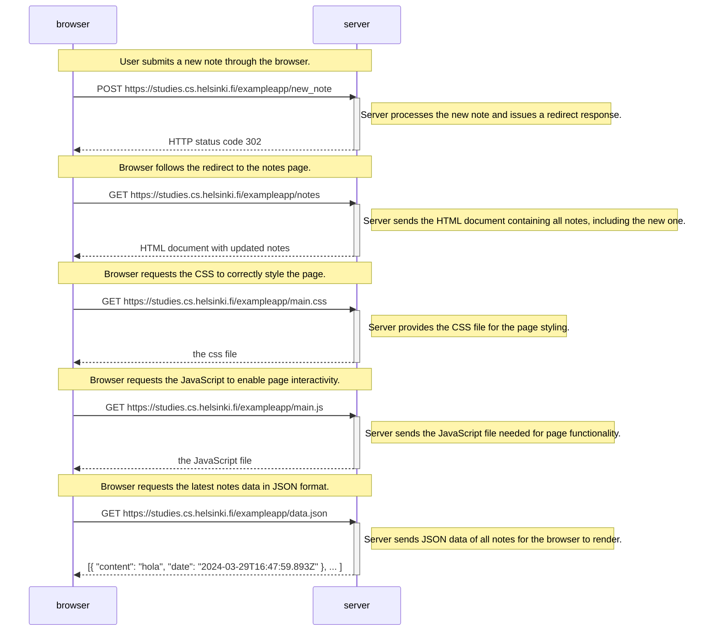

```mermaid
sequenceDiagram
    participant browser
    participant server

    Note over browser,server: User submits a new note through the browser.
    browser->>server: POST https://studies.cs.helsinki.fi/exampleapp/new_note
    activate server
    Note right of server: Server processes the new note and issues a redirect response.
    server-->>browser: HTTP status code 302
    deactivate server

    Note over browser,server: Browser follows the redirect to the notes page.
    browser->>server: GET https://studies.cs.helsinki.fi/exampleapp/notes
    activate server
    Note right of server: Server sends the HTML document containing all notes, including the new one.
    server-->>browser: HTML document with updated notes
    deactivate server

    Note over browser,server: Browser requests the CSS to correctly style the page.
    browser->>server: GET https://studies.cs.helsinki.fi/exampleapp/main.css
    activate server
    Note right of server: Server provides the CSS file for the page styling.
    server-->>browser: the css file
    deactivate server

    Note over browser,server: Browser requests the JavaScript to enable page interactivity.
    browser->>server: GET https://studies.cs.helsinki.fi/exampleapp/main.js
    activate server
    Note right of server: Server sends the JavaScript file needed for page functionality.
    server-->>browser: the JavaScript file
    deactivate server

    Note over browser,server: Browser requests the latest notes data in JSON format.
    browser->>server: GET https://studies.cs.helsinki.fi/exampleapp/data.json
    activate server
    Note right of server: Server sends JSON data of all notes for the browser to render.
    server-->>browser: [{ "content": "hola", "date": "2024-03-29T16:47:59.893Z" }, ... ]
    deactivate server

```