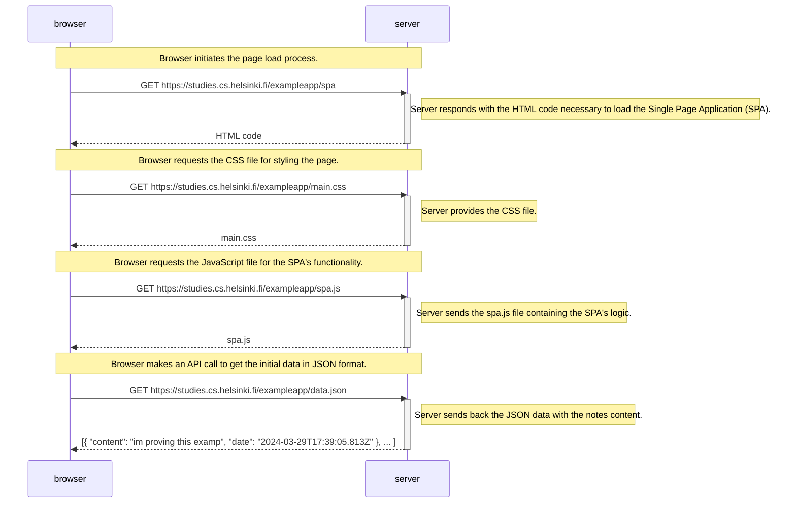

```mermaid

sequenceDiagram
    participant browser
    participant server

    Note over browser,server: Browser initiates the page load process.
    browser->>server: GET  https://studies.cs.helsinki.fi/exampleapp/spa
    activate server
    Note right of server: Server responds with the HTML code necessary to load the Single Page Application (SPA).
    server-->>browser: HTML code
    deactivate server

    Note over browser,server: Browser requests the CSS file for styling the page.
    browser->>server: GET https://studies.cs.helsinki.fi/exampleapp/main.css
    activate server
    Note right of server: Server provides the CSS file.
    server-->>browser: main.css
    deactivate server

    Note over browser,server: Browser requests the JavaScript file for the SPA's functionality.
    browser->>server: GET https://studies.cs.helsinki.fi/exampleapp/spa.js
    activate server
    Note right of server: Server sends the spa.js file containing the SPA's logic.
    server-->>browser: spa.js
    deactivate server

    Note over browser,server: Browser makes an API call to get the initial data in JSON format.
    browser->>server: GET https://studies.cs.helsinki.fi/exampleapp/data.json
    activate server
    Note right of server: Server sends back the JSON data with the notes content.
    server-->>browser: [{ "content": "im proving this examp", "date": "2024-03-29T17:39:05.813Z" }, ... ]
    deactivate server

```