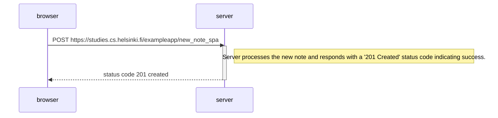

```mermaid

sequenceDiagram
    participant browser
    participant server
   
    browser->>server: POST  https://studies.cs.helsinki.fi/exampleapp/new_note_spa
    activate server
    Note right of server: Server processes the new note and responds with a '201 Created' status code indicating success.
    server-->>browser: status code 201 created
    deactivate server

```